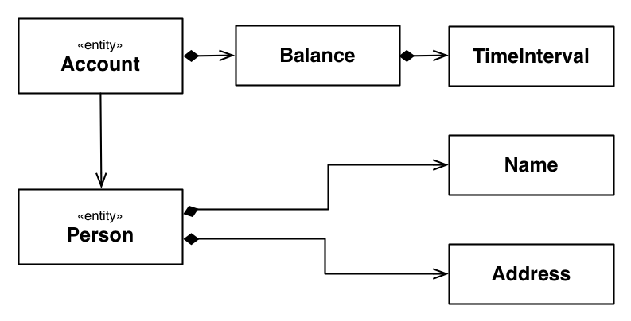

Snowdrop Sportsclub Example
===========================

*Abstract*

This book provides a walkthrough of the JBoss Snowdrop Sportsclub example. It illustrates several use cases for integrating the JBoss Enterprise Application Platform with the Spring Framework.

link:#chap-guide-Test_Chapter[2. Introduction]
link:#idm209481282464[2.1. Sportsclub example variants]
link:#sect_building[2.2. Building the application]
link:#idm209485704576[2.3. Preparing your JBoss Enterprise Application Platform]
link:#idm209511714656[2.4. Deploying the application]
link:#idm209512688592[2.5. Sportsclub and Red Hat JBoss Developer Studio]
link:#chap-guide-usecases[3. Understanding the Application Structure]
link:#idm209487050144[3.1. The Application Structure and its Use Cases]
link:#idm209480767376[3.2. A comparative look of the project modules]
link:#chap-guide-modules[4. Using JBoss and Spring together]
link:#idm209474492896[4.1. JBoss/Spring integration use cases]
link:#idm209485038384[4.2. The domain model]
link:#idm209485025392[4.3. Persistence implementation: JPA and Hibernate]
link:#idm209484823968[4.3.1. The Hibernate implementation]
link:#idm209484388912[4.3.2. The JPA implementation]
link:#idm209484380784[4.3.3. Unit testing the repositories]
link:#idm209484375120[4.4. Service Layer]
link:#idm209484369088[4.4.1. The Spring-based service layer]
link:#idm209484367408[4.4.2. The EJB service layer]
link:#idm209484335136[4.5. Presentation Layer]
link:#idm209484330352[4.5.1. Subscriptions: JSF and EJB]
link:#idm209484328784[4.5.2. Reservations: JSF/Spring integration]
link:#sect_webflow[4.5.3. Reservations-Webflow: Conversation-based reservations]
link:#idm209474183664[4.5.4. Invoicing: Spring MVC and EJB]
link:#idm209474170544[4.5.5. A problem of reusing content]
link:#idm209474162672[4.6. Enterprise Integration Features]
link:#idm209474160608[4.6.1. Payment processing: JMS integration through JCA]
link:#idm209474146992[4.6.2. Aspects and auditing]
link:#idm209474141504[4.6.3. Configuring Spring beans through JMX]
link:#idm209474133872[4.6.4. Payment processing: exposing a JAX-WS web service]
link:#idm209474127216[4.6.5. Implementing a Spring Web Services web service]
link:#idm209482039776[4.7. Secure invoicing: JBoss-preauthenticated security]

== 2. Introduction

link:#idm209481282464[2.1. Sportsclub example variants]
link:#sect_building[2.2. Building the application]
link:#idm209485704576[2.3. Preparing your JBoss Enterprise Application Platform]
link:#idm209511714656[2.4. Deploying the application]
link:#idm209512688592[2.5. Sportsclub and Red Hat JBoss Developer Studio]

The Sportsclub application provides a real-world-inspired example of integrating Spring with JBoss Enterprise Application Platform. It consists of three web applications, which illustrate several use cases through various combinations of components and technologies. It also illustrates how to use the Snowdrop libraries to provide JBoss-specific features, such as creating a standalone deployment of an `ApplicationContext` and injecting beans from that application context into non-Spring components like Enterprise Java Beans (EJBs).

This book aims to illustrate the mechanics of using Spring with different Java EE 6 components in the specific context of JBoss Enterprise Application Platform, and to recommend methods of achieving certain integration goals.

The Sportsclub example is not intended as a guide to creating a domain model. Detailing the various layers of application and UI design is outside the scope of this document. As such, the example application has been designed to illustrate integration use cases, rather than to demonstrate a domain model that strictly follows principles of object-oriented and domain-driven design.

The Sportsclub example uses RichFaces as a component library for JavaServer Faces (JSF). Consult the RichFaces documentation for RichFaces-specific information.

=== ⁠2.1. Sportsclub example variants

The Sportsclub example is provided in several variants, with similar structures and functions. The variants differ due to the version of Spring as follows:

* The Spring 3.2 variant uses Spring Security 3.2.x and Spring Webflow 2.3.x.
* The Spring 4.0 variant uses Spring Security 3.2.x and Spring Webflow 2.3.x.

=== ⁠2.2. Building the application

This step explains building the application. The Sportsclub example uses Maven, so it is built by running:
[source]
----
mvn clean package
----

This will produce two EAR files, both named `sportsclub.ear`, located under `sportsclub-ear/target` and `sportsclub-jpa-ear/target`. They have the same functionality, but the underlying implementation of the persistence layer is different (one is using Hibernate, and another one uses JPA).
*Important*

The built application has a profile, _messaging_, which builds a JMS-enabled variant of the application.
The _messaging_ profile will be used for enabling and disabling JMS integration. When running in environments where messaging is not enabled, like the Web Profile of Red Hat JBoss Enterprise Application Platform (by default standalone.xml configuration file is used), it can be disabled by running:
[source]
----
mvn clean package -P!messaging 
OR
mvn clean package -P-messaging
----

=== ⁠2.3. Preparing your JBoss Enterprise Application Platform

The JBoss Enterprise Application Platform needs to be set up to run your application. This step involves:

* setting up the Spring deployer
* creating a Destination for JMS-related features
* creating a security domain

The Spring deployer is set up by extracting the Snowdrop and Spring modules and copying them to the `$JBOSS_HOME/modules` directory and adding the Snowdrop subsystem to the target profile. Refer to the Spring deployer section of the _Snowdrop User Guide_ for details.
For creating the required JMS destination, add the highlighted definition to the messaging subsystem, in `$JBOSS_HOME/standalone/configuration/standalone-full.xml`:
[source]
----
<subsystem xmlns="urn:jboss:domain:messaging:1.3">
    ...
        <hornetq-server>
            ...
                <jms-destinations>
            ...
            <!-- Code to be added starts here -->
                <jms-queue name="sportsclub">
                     <entry name="queue/sportsclub"/>
                </jms-queue>
            <!-- Code to be added ends here -->
        </jms-destinations>
    </hornetq-server>
</subsystem>
----

For creating the security domain, add the indicated highlighted definition to the security subsystem:
[source]
----
<subsystem xmlns="urn:jboss:domain:security:1.2">
    <security-domains>
        ...
        <!-- Code to be added starts here -->
            <security-domain name="employees">
                <authentication>
                    <login-module code="Database" flag="required">
                        <module-option name="dsJndiName" value="java:jboss/datasources/ExampleDS"/>
                        <module-option name="principalsQuery" value="select passwd from SPORTSCLUB_USERS where username=?"/>
                        <module-option name="rolesQuery" value="select userRoles,'Roles' from SPORTSCLUB_ROLES where username=?"/>
                    </login-module>
                </authentication>
            </security-domain>
        <!-- Code to be added ends here -->
    </security-domains>
</subsystem>
----

=== ⁠2.4. Deploying the application

Copy one of the two EARs produced by the build to the deploy folder of your JBoss Enterprise Application Platform: `$JBOSS_HOME/standalone/deployments`. The two alternative build files are:
sportsclub-ear/target/sportsclub.ear::
  Hibernate-based implementation
sportsclub-jpa-ear/target/sportsclub.ear::
  JPA-based implementation, using Hibernate as the underlying provider

=== ⁠2.5. Sportsclub and Red Hat JBoss Developer Studio

Sportsclub is a Maven-based project, so you can import it into JBoss Developer Studio.

 ⁠
*Procedure 2.1. To import sportsclub into Red Hat JBoss Developer Studio*

1.  Go to *File* → *Import*.
2.  In the Import window, double-click *Maven* → *Existing Maven Projects*.
3.  In the *Import Maven Projects* window, click *Browse* and select *sportsclub*. Then select the version of Spring to use.
+
Result
The top-level pom and the module subpoms are displayed.
4.  Click *Finish*.

At this point, it is important to choose if you would like to have the messaging profile in the application. The messaging profile is activated by default and you can deactivate the messaging profile.

 ⁠
*Procedure 2.2. To deactivate the messaging profile:*

1.  Right-click on *sportsclub-invoicing-webmvc* submodule in the *Project* tab in the left pane.
2.  In the right-click menu, go to *Maven* → *Select Maven Profiles*.
3.  In the *Select Maven profiles* window, select *messaging* from the *Available profiles* list.
4.  Click *Deactivate* and then click *OK*.

There are slight differences between the context definitions that apply in various configurations, and some definitions may not be included (as is the case with the messaging profile). This means that the poms of several modules include alternative locations for web resources, which are added by Maven at build time.

 ⁠
*Procedure 2.3. To add web resources to a project:*

1.  Go to *Project* → *Properties*.
2.  In the left pane of properties window, click *Deployment Assembly* and then click *Add*.
3.  In the *New Assembly Directive* window, double-click *Folder* and select the folder to be included in the deployment assembly.
4.  Click *Finish*.
5.  Click *Apply* and then click *OK*.
+
Result
The contents of the selected folder are added automatically in the document root of the application.

Depending on the selected profiles, additional directories need to be added as shown in the following table:

 ⁠
 
.Table 2.1. Additional resource folders per module and profile
[width="99%",cols="34%,33%,33%",options="header",]
|=========================================
|Module |Active profile |Additional folder
|sportsclub-invoicing-webmvc a|
* messaging

 a|
* src/main/webapp-messaging

|=========================================

*Note*

The application activates messaging profile by default, so additional resources need to be added even if active profiles are not explicitly indicated.
The application is ready to run.

1.  On the *Servers* view, choose a JBoss Enterprise Application Platform 6 server.
2.  Add one of the two EAR projects:
+
* sportsclub-ear
* sportsclub-jpa-ear
3.  Start the project.

== 3. Understanding the Application Structure

link:#idm209487050144[3.1. The Application Structure and its Use Cases]
link:#idm209480767376[3.2. A comparative look of the project modules]

This chapter describes the business use cases covered by the application, and how the functionality is distributed across the modules.

=== ⁠3.1. The Application Structure and its Use Cases

The Sportsclub example consists of three different applications sharing the same domain model, packaged, and deployed together. This is done for simplicity and to demonstrate different technologies and configuration options working side by side.
The business domain of the application is a Sports Club. The employees of the club need to be able to perform the following scenarios:

* maintaining information about subscribers, creating new subcriptions and closing existing accounts;
* creating, modifying and removing equipment reservations for subscribers;
* viewing the current balance of an account, issuing invoices for accounts that do not have a current invoice and updating the account whenever a payment has been received.

Each of these scenarios is covered by a separate web application, and all three applications are packaged in a single EAR file.
All three applications share a common domain model and a common DAO/repository layer, implemented using Spring. The application includes both Hibernate and JPA implementations for the repository layer (using the Hibernate and JPA support provided by Red Hat JBoss Enterprise Application Platform, respectively). The application is built in two different variants, each using one of the two DAO implementation alternatives.
Apart from that, each web application uses a different combination of technologies, illustrating one or more integration use cases.
The Subscriptions application uses an EJB-based service layer and a JSF-based front-end, using Richfaces components.
The Invoicing application uses the following stack:

* UI layer implemented using Spring MVC and JSP
* Business layer implemented using EJB
* Persistence layer implemented using Spring-based DAOs (Hibernate/JPA)

In all three cases, the persistence layer is implemented using Spring. In fact there are two alternative implementations: one using Hibernate directly and one using JPA (and Hibernate as the provider). Building the application creates two different EAR files, one using the JPA-based DAOs and one using the Hibernate-based DAOs.

=== ⁠3.2. A comparative look of the project modules

The modules (Maven artifacts) of the project are outlined in the following table:

 ⁠
 
.Table 3.1. Modules of the Sportsclub project
[width="99%",cols="34%,33%,33%",options="header",]
|====================================================================================================================================================
|Maven Module |Functionality |Module Type
|sportsclub-bom |No functionality, centralizes the dependencies of the project. |pom
|sportsclub-domain |Domain classes and repository interfaces. |jar
|sportsclub-hibernate-dao |Hibernate implementations for repositories and Spring bean definitions using them. |jar
|sportsclub-jpa-dao |JPA implementations for repositories and Spring bean definitions using them. |jar
|sportsclub-invoicing-ejb |Business logic for the Invoicing application |ejb
|sportsclub-reservations-spring |Business logic for the Reservations application |jar
|sportsclub-subscriptions-ejb |Business logic for the Subscriptions application |ejb
|sportsclub-invoicing-webmvc |UI layer for the Invoicing application. Includes processing of JMS messages via Spring (for payment notifications) |war
|sportsclub-reservations-web |UI layer for the Reservations application. |war
|sportsclub-reservations-webflow |UI layer for the Reservations application, implemented using Spring webflow |war
|sportsclub-subscriptions-web |UI layer for the Subscriptions application |war
|sportsclub-ear |EAR aggregator module using the Hibernate-based implementation |ear
|sportsclub-jpa-ear |EAR aggregator module using the JPA-based implementation |ear
|sportsclub-staticwebcontent |Static web content for the application (not deployed separately, but included at build-time in the web layers) |war
|sportsclub-test-infrastructure |Infrastructure module for unit testing |jar
|====================================================================================================================================================

== 4. Using JBoss and Spring together

link:#idm209474492896[4.1. JBoss/Spring integration use cases]
link:#idm209485038384[4.2. The domain model]
link:#idm209485025392[4.3. Persistence implementation: JPA and Hibernate]
link:#idm209484823968[4.3.1. The Hibernate implementation]
link:#idm209484388912[4.3.2. The JPA implementation]
link:#idm209484380784[4.3.3. Unit testing the repositories]
link:#idm209484375120[4.4. Service Layer]
link:#idm209484369088[4.4.1. The Spring-based service layer]
link:#idm209484367408[4.4.2. The EJB service layer]
link:#idm209484335136[4.5. Presentation Layer]
link:#idm209484330352[4.5.1. Subscriptions: JSF and EJB]
link:#idm209484328784[4.5.2. Reservations: JSF/Spring integration]
link:#sect_webflow[4.5.3. Reservations-Webflow: Conversation-based reservations]
link:#idm209474183664[4.5.4. Invoicing: Spring MVC and EJB]
link:#idm209474170544[4.5.5. A problem of reusing content]
link:#idm209474162672[4.6. Enterprise Integration Features]
link:#idm209474160608[4.6.1. Payment processing: JMS integration through JCA]
link:#idm209474146992[4.6.2. Aspects and auditing]
link:#idm209474141504[4.6.3. Configuring Spring beans through JMX]
link:#idm209474133872[4.6.4. Payment processing: exposing a JAX-WS web service]
link:#idm209474127216[4.6.5. Implementing a Spring Web Services web service]
link:#idm209482039776[4.7. Secure invoicing: JBoss-preauthenticated security]

This chapter describes the various Spring and JBoss integration use cases covered by the application and how they are implemented in the various application modules.
As a Spring application that consists of multiple modules, the main strategy of constructing the global Spring configuration is to provide Spring bean definition fragments in each artifact produced by a module, leaving the upper layer components to aggregate them by importing. This strategy allows the separation of concerns between components; the Spring wiring of certain components is left at the level where the components are defined, so that it can be changed easily if the implementations change.

=== ⁠4.1. JBoss/Spring integration use cases

The Sportsclub application covers a number of JBoss and Spring integration use cases. The scenarios selected for this example are focused on using the Java EE 6 services provided by JBoss Enterprise Application Platform in Spring applications.
The use cases are grouped in categories as follows:

 ⁠
 
.Table 4.1. Use case list overview
[width="99%",cols="34%,33%,33%",options="header",]
|===================================================================================================================================================================================================================================================================================================================================================================================================================
|Category |Use case |How does this involve JBoss Enterprise Application Platform
|Persistence |Spring/Hibernate integration |The application uses a Spring-configured Hibernate SessionFactory, using JTA transaction management and JTA-bound sessions. The Hibernate library is the one provided by JBoss Enterprise Application Platform.
| |Spring/JPA integration |The Persistence Unit is deployed by JBoss Enterprise Application Platform and retrieved from JNDI to be injected into Spring beans. PersistenceContext is shared with surrounding EJBs (if any)
|Testing |Unit-testing components that have managed infrastructure dependencies |The DataSource and EntityManager are managed by JBoss and acquired from JNDI by Spring when the application is running. In the case of JBoss Enterprise Application Platform, developers can test their code in isolation using Spring-specific replacements that 'simulate' the JBoss Enterprise Application Platform environment.
|Business Logic |Spring-based service beans |The business services are Spring-managed and wrapped into transactions managed by Spring's interceptors. The TransactionManager in use is the JTATransactionManager using JBoss Transactions provided in JBoss Enterprise Application Platform.
| |EJBs injected with Spring Beans |The application uses JBoss-deployed EJBs which are injected with Spring beans acquired from an application context bootstrapped by the Spring Deployer. Transactions are managed by EJBs.
|User Interface |JSF/RichFaces and Spring integration |The application uses the JBoss Enterprise Application Platform-provided JSF support, and RichFaces components. The business services and UI-backing instances are Spring beans.
| |Spring MVC and EJB integration |The application uses Spring MVC and the business logic is implemented using JBoss-deployed EJBs, which are injected into the Spring controllers.
| |Conversation-oriented web application |The application uses Spring Web Flow for defining a conversational process for creating a reservation
|JMS/JCA integration |JMS/Spring integration using JCA |Spring-configured message listeners are used for processing JMS messages from JBoss Enterprise Application Platform-managed destinations. The application uses the Spring /JCA integration for receiving messages.
|Aspect-oriented programming |Spring-based weaving of POJO aspects |This use case does not have any JBoss Enterprise Application Platform-specific functionality.
|JMX |Spring beans are exposed as JMX beans |The JBoss Enterprise Application Platform MBean Server is used for registering the Spring-exported JMX beans. Consequently, the Spring beans can be managed from a management console.
|Web Services |JAX-WS defined web-services are injected with Spring beans |The application uses JBoss Enterprise Application Platforms' support for JAX-WS through JBoss WS, but also Spring to define the underlying business logic, which is injected into the JBoss WS-deployed services.
| |A Spring Web Services-based variant of the JAX-WS example |The application implements a web service based on Spring Web Services.
|Security |Application-server pre-authentication |The application uses Spring Security for authorizing access to resources. Authentication is provided by the application server.
|===================================================================================================================================================================================================================================================================================================================================================================================================================

=== ⁠4.2. The domain model

The Sportsclub-domain module is the only module of the application that does not integrate with Spring directly. However, it is used further in the application as it provides:

* the entities that the application will interact with;
* the repository interfaces that provide persistence services for the application;

*Note*

The term 'repository' is used for the components that retrieve objects from persistence and save them. This is done to indicate that the design of the application is emulating the concepts behind Domain-Driven Design, where objects that are used for providing the persistence and entity lookup functions are part of the domain, rather than simple persistence implementation strategies.

 ⁠
 
.Figure 4.1. Domain entities of the application and their connections
image::images/domain-entities.png[Domain entities of the application and their connections]

link:#fig1[Figure 4.1, “Domain entities of the application and their connections”] shows the domain entities of the application. link:#fig2[Figure 4.2, “The Account and Person entities”] shows a more detailed overview of the entities involved in the Account/Person relationship, including the non-entity domain objects.

 ⁠
 
.Figure 4.2. The Account and Person entities

=== ⁠4.3. Persistence implementation: JPA and Hibernate

The persistence modules: `sportsclub-hibernate-dao` and `sportsclub-jpa-dao` are alternative implementations of the application's persistence strategy. This means that each module will provide:

* implementations for the repository interfaces defined in the Sportsclub-domain module;
* Spring context definition fragments that can be reused elsewhere in the application

Effectively, the Spring configuration fragments will expose a bean implementation for each repository interface defined in the model. This means that the implementations can be swapped at build-time without any change in the business layer. This is the basis for the build process creating two different builds, each based on a different persistence implementation - including a different repository implementation jar and leaving everything else in the component stack unchanged.
Each module produces a set of beans that can be injected further into the business services of the application.

==== ⁠4.3.1. The Hibernate implementation

The Hibernate-based repository implementation defines a generic superclass defining all the common repository operations that the repository implementations will parametrize by specifying the entity type and primary key type.
[source]
----
public abstract class HibernateRepository<T, I extends Serializable> implements Repository<T, I>
{
    protected SessionFactory sessionFactory;

    Class<T> clazz;

    public HibernateRepository(Class<T> clazz)
    {
        this.clazz = clazz;
    }

    public void setSessionFactory(SessionFactory sessionFactory)
    {
        this.sessionFactory = sessionFactory;
    }

    protected Session getCurrentSession()
    {
        return this.sessionFactory.getCurrentSession();
    }
   
    public T findById(I id)
    {
        return (T)getCurrentSession().get(clazz, id);
    }

    public T save(T object)
    {
        T mergedInstance = (T) getCurrentSession().merge(object);
        //force a flush to refresh the id
        getCurrentSession().flush();
        return mergedInstance;
    }

    public void delete(T object)
    {
        getCurrentSession().delete(object);
    }

    public List<T> findAll()
    {
        return getCurrentSession().createCriteria(clazz).list();
    }

    public long countAll()
    {
        return (Integer)getCurrentSession().createCriteria(clazz).setProjection(Projections.count("id")).uniqueResult();
    }

    public Criteria applyRange(Criteria criteria, Range range)
    {
        return criteria.setFirstResult(range.getMinIndex()).setMaxResults(range.length());
    }
}
----

It is important to notice that this implementation and its subclasses are not Spring-based. The only Spring-related component of this module is the configuration which consists of the following files:
`sportsclub-hibernate-dao/src/main/resources/dao-context.xml`::
  Contains:
  +
  * the Spring bean definitions for the repository implementations
  * the Spring-based `SessionFactory` definition (a `LocalSessionFactoryBean`), and;
  * the wiring of session factories into Spring beans.
`sportsclub-hibernate-dao/src/main/resources/infrastructure.xml`::
  Contains:
  +
  * the definitions for infrastructure-related Spring beans, namely the data source to be used for the Hibernate `SessionFactory`, and;
  * the transaction manager.

Separating the infrastructure context definition file from the rest of the bean definitions allows swap between the infrastructure definition for unit testing. For example, the Hibernate SessionFactory is configured to use JTA transactions, and allows the Session to be shared with a layer of EJBs that delegate to it.

==== ⁠4.3.2. The JPA implementation

The JPA implementation is similar to the Hibernate implementation. It provides a parametrized superclass that is Spring-agnostic as well (except for the usage of the autowiring annotation, which can be replaced by a simple setter if any reference to Spring needs to be removed). Besides the fact that it is using the JPA API - for example, an EntityManager instead of the SessionFactory - the JPA Persistence Unit (and subsequent EntityManager) are created by the application server and not by Spring (the EntityManager is injected by Spring, but acquired from JNDI). The persistence unit is deployed from within the JPA repository jar, in order to allow the spring-domain jar to be deployed in non-JPA scenarios (for example, Hibernate) without triggering a persistence unit deployment.
The Spring application context configuration fragments are very similar to the ones encountered in the Hibernate module:
`sportsclub-jpa-dao/src/main/resources/dao-context.xml`::
  Contains the Spring bean definitions for the repository implementations, assuming an `EntityManager` bean is defined in the global application context definition.
`sportsclub-jpa-dao/src/main/resources/infrastructure.xml`::
  Contains the definitions for infrastructure-related Spring beans, namely the entityManger bean to be wired into JpaRepository class and the transaction manager.

==== ⁠4.3.3. Unit testing the repositories

Given that the infrastructure is tied tightly to the Application Platform, the repositories should be tested in isolation before integrating them with the rest of the application. If the services that the JBoss Enterprise Application Platform provides will be used at deployment time, use an embedded database, Spring's ability to create LocalSessionFactories, LocalEntityManagerFactories, and its local transaction management abilities.
To do this, use the sportsclub-test-infrastructure module, which is a test-scoped dependency. This module contains the modules used for setting up an embedded database. This is done by producing a DataSource that can be injected into the LocalSessionFactoryBean, and LocalContainerEntityManagerFactoryBean respectively. The localized SessionFactory and EntityManager defintions are located in the sportsclub-hibernate-dao, and sportsclub-jpa-dao modules, respectively.
The unit tests that are located in the respective modules use the local infrastructure files and the `dao-context.xml` files, as in the following example:
[source]
----
@ContextConfiguration(locations = 
    {"classpath:test-db-infrastructure.xml",
        "classpath:TEST-jpa-infrastructure.xml",
        "classpath:dao-context.xml"})
@RunWith(SpringJUnit4ClassRunner.class)
public class TestJpaAccountRepository
{
   /* */
}
----

This configuration reuses the 'application-specific' context configuration fragment, as well as two test-specific (or local) context configuration fragments in order to create a Spring context in isolation. This way, the functionality provided by the repositories can be tested outside the running application.

=== ⁠4.4. Service Layer

On top of the domain and persistence layer sits the service layer of the application. Its role is to coordinate the domain objects and repositories in order to perform higher level operations. This is also the layer which provides transaction demarcation. One consideration for which transaction demarcation should be done at service level is to ensure that the changes made by service operations are atomic. Otherwise, concurrent operations may leave the application data in an inconsistent state. Demarcating transactions at the repository/DAO level should be done carefully, taking into consideration that multiple repository/DAO invocations that are not surrounded by a wrapping transactions will execute in separate transactional contexts.
In the Sportsclub application, there are two variants of implementing the service layer:

* using Spring (Reservations, parts of Invoicing)
* using EJB (Subscriptions, Invoicing)

*Note*
It is possible to define transactions at the repository level, avoiding another indirection to the persistence layer for simple persistence operations (finding an object, persisting an object).

==== ⁠4.4.1. The Spring-based service layer

The Spring-based service layer exposes a number of service beans that can be consumed by the UI, which are injected with the beans defined in the persistence layer. This is the level where transaction demarcation is provided by the use of the appropriate Spring annotations.

==== ⁠4.4.2. The EJB service layer

A common scenario in Spring/EJB integration is the wrapping of Spring Beans in EJBs. This is often done in order to get advantage of the services provided by the EJB container (security, declarative transaction management), while keeping some of the objects they collaborate with as simple POJOs. In this scenario, the EJBs form the outermost layer of the business logic, the one that is exposed to the rest of the application (UI). In this scenario, the EJB services are injected with the Spring-based repositories.
JBoss has its own native support for Spring/EJB integration, in the form of the Spring Deployer and special annotations for injection of Spring beans into EJBs.

===== ⁠4.4.2.1. The Spring Deployer

The Spring Deployer is a JBoss-specific deployer that can be used to bootstrap a Spring ApplicationContext and register it into JNDI. The configuration files for bootstrapping the application context are defined at the EAR level, and the Spring ApplicationContext is shared to all the components. The definition file is simple, and just imports the contexts defined in the JPA jars.
[source]
----
<beans xmlns="http://www.springframework.org/schema/beans"
xmlns:xsi="http://www.w3.org/2001/XMLSchema-instance"
xsi:schemaLocation="http://www.springframework.org/schema/beans http://www.springframework.org/schema/beans/spring-beans.xsd">

    <description>BeanFactory=(SpringDao)</description>

    <import resource="classpath*:dao-context.xml"/>
    <import resource="classpath*:infrastructure.xml"/>

</beans>
----

===== ⁠4.4.2.2. Injection into EJBs

Once the ApplicationContext is created, the beans defined there can be injected into EJBs. So, in this case, the Spring repositories will be injected into EJBs as follows:
[source]
----
@Stateless
@Interceptors(SpringLifecycleInterceptor.class)
public class BillingServiceImpl implements BillingService
{
   @Spring(bean = "invoiceRepository", jndiName = "SpringDao")
   private InvoiceRepository invoiceRepository;

   /* rest of the class definition ommitted */
}
----

The injection task is undertaken by the SpringLifecycleInterceptor. Once it encounters a field or setter annotated with @Spring, it will look for the JNDI-bound application context and inject the corresponding Spring bean.

=== ⁠4.5. Presentation Layer

The three web applications which compose the Sportsclub package illustrate different ways of integrating Spring and Java EE technologies in the presentation layer:

* JSF/EJB with an underlying Spring layer (Subscriptions)
* JSF/Spring (Reservations)
* Spring MVC/EJB (Invoicing)

==== ⁠4.5.1. Subscriptions: JSF and EJB

The Subscriptions application uses RichFaces and JSF for the presentation layer and EJB for the business layer, so this part of the application is not Spring-related.

==== ⁠4.5.2. Reservations: JSF/Spring integration

The Reservations application is an example of using Spring in an application that uses RichFaces and JSF. Here, Spring beans are used as business services for the application, as well as backing beans for the JSF pages. In the latter case, Spring beans replace the managed beans and other web artifacts used by JSF.
The Spring application context is bootstrapped by the ContextLoaderListener defined in `/WEB-INF/web.xml`. The Spring configuration file in use is `/WEB-INF/spring-beans.xml`, which:

* imports the context definition fragments included in the other JARs of the application (that is, the JARs that contain the business logic)
* defines a number of Spring beans that are used directly in the web tier by the JSF pages or by the RichFaces components;

The Spring configuration file imports the Spring business beans and infrastructure definitions as follows:
[source]
----
<import resource="classpath*:reservations-service.xml"/>
<import resource="classpath*:infrastructure.xml"/>
----

The following bean is used for backing JSF pages. Please note that Spring beans defined in the web layer may use scopes, and a significant number of the Spring beans used in Reservations application are session-scoped (like the one in the following example). Spring provides a request scope as well, but it is not used in this example.
[source]
----
<bean id="reservationCreate" class="org.jboss.snowdrop.samples.sportsclub.jsf.beans.ReservationCreate" scope="session" init-method="init">
        <property name="reservationService" ref="reservationService"/>
        <property name="accountService" ref="accountService"/>
        <property name="accountFilter" ref="accountFilterCreate"/>
        <property name="equipmentFilter" ref="equipmentFilterCreate"/>
        <property name="reservationSearch" ref="reservationSearch"/>
</bean>
----

In order to make the Spring beans visible to JSF pages, a special VariableResolver has to be defined in `/WEB-INF/faces-config.xml`.
[source]
----
<application>
    <!-- other definitions -->
        <el-resolver>org.springframework.web.jsf.el.SpringBeanFacesELResolver</el-resolver>
</application>
----

The Spring bean defined above can be used directly in a JSF page, as in the following excerpt from `createReservation.xhtml`:
[source]
----
<rich:panel>
    <f:facet name="header">Select Account</f:facet>
    <h:form id="AccountSelectForm">
        <rich:extendedDataTable id="accountsTable"
            value="#{accountFilterCreate}" var="account"
            selectionMode="single"
            selection="#{accountFilterCreate.selection}"
            enableContextMenu="true" height="250px" rows="5">
            <a4j:ajax event="selectionchange"
                listener="#{reservationCreate.updateSelectedAccount}"
                render="reservationDetails" />

            <rich:column label="Id" width="7%">
                <f:facet name="header">
                    <h:outputText value="Id" />
                </f:facet>
                <h:outputText value="#{account.id}" />
            </rich:column>

            <rich:column label="First Name">
                <f:facet name="header">
                    <h:outputText value="First Name" />
                </f:facet>
                <h:outputText value="#{account.subscriber.name.firstName}" />
            </rich:column>

            <rich:column label="Last Name">
                <f:facet name="header">
                    <h:outputText value="Last Name" />
                </f:facet>
                <h:outputText value="#{account.subscriber.name.lastName}" />
            </rich:column>

            <rich:column label="City">
                <f:facet name="header">
                    <h:outputText value="City" />
                </f:facet>
                <h:outputText value="#{account.subscriber.address.city}" />
            </rich:column>

            <rich:column label="Country">
                <f:facet name="header">
                    <h:outputText value="Country" />
                </f:facet>
                <h:outputText value="#{account.subscriber.address.country}" />
            </rich:column>

            <f:facet name="footer">
                <rich:dataScroller id="scrollerAccount" for="accountsTable"
                    maxPages="5" page="#{accountFilterCreate.currentPage}" />
            </f:facet>
        </rich:extendedDataTable>
    </h:form>
</rich:panel>
----

All the EL variables that are used in the previous example, including the ones referenced in the RichFaces elements are Spring beans. They can be used either as backing beans for retrieving and setting values, as well as for invoking methods corresponding to JSF events.

==== ⁠4.5.3. Reservations-Webflow: Conversation-based reservations

The reservations application included in the Sportsclub packages uses Spring Webflow. As with the previous example, the main view technology is JSF2, using Richfaces as a component library, and Spring, which is used for managing the backing beans for JSF pages and business services.
However, unlike the previous example where the interaction is form-based, this application uses a conversation-based model for driving the user interaction. A reservation is created in a sequence of steps that represents a conversation - a distinct scope which spans multiple requests, but less broad than a session. The input data (selected account, selected equipment and date) are preserved for the duration of the conversation, and discarded automatically after the conversation has ended. The Sportsclub application uses Spring Webflow for implementing conversation-based multi-step dialogues.
The Spring business application context is bootstrapped by the ContextLoaderListener defined in `/WEB-INF/web.xml`. The Spring configuration file in use is `/WEB-INF/spring-beans.xml`, which:

* imports the context definition fragments included in the other JARs of the application (that is, the JARs that contain the business logic)
* defines a number of Spring beans that are used directly in the web tier by the JSF pages or by the Richfaces components;

For the UI and Spring Webflow integration, the application defines a DispatcherServlet in `web.xml`, in a similar way to Spring MVC applications.
[source]
----
<webflow:flow-registry id="flowRegistry" flow-builder-services="flowBuilderServices">
    <webflow:flow-location path="/WEB-INF/flows/reservation/reservation-flow.xml" id="reservation"/>
</webflow:flow-registry>

<webflow:flow-executor flow-registry="flowRegistry" id="flowExecutor">
    <webflow:flow-execution-listeners>
    <webflow:listener ref="facesWebFlowListener"/>
    </webflow:flow-execution-listeners>
</webflow:flow-executor>

<bean class="org.springframework.webflow.mvc.servlet.FlowHandlerAdapter">
    <property name="flowExecutor" ref="flowExecutor"/>
    <property name="ajaxHandler">
        <bean class="org.springframework.faces.webflow.JsfAjaxHandler"/>
    </property>
</bean>

<bean class="org.springframework.webflow.mvc.servlet.FlowHandlerMapping">
    <property name="flowRegistry" ref="flowRegistry"/>
    <property name="order" value="1"/>
</bean>

<faces:resources/>

<faces:flow-builder-services id="flowBuilderServices" development="true"/>

<bean id="facesWebFlowListener" 
        class="org.springframework.faces.webflow.FlowFacesContextLifecycleListener"/>

----

The definitions above include:

* a flow registry containing the flow definitions;
* a flow executor which is the Spring Webflow engine;
* a pair of FlowHandlerAdapter and FlowHandlerMapping beans which ensure that any requests that are handled by the DispatcherServlet declared in `web.xml` are delegated to the Spring Webflow executor;
* the flowBuilderServices and facesWebFlowListener beans are used for integrating Spring Webflow with JSF. In other words, for using JSF views for rendering the view states.

The application is using a flow definition for creating a reservation, described in `/WEB-INF/flows/reservation/reservation-flow.xml`. The JSF pages used for rendering the flow views are located in the same `/WEB-INF/flows/reservation/` directory.

==== ⁠4.5.4. Invoicing: Spring MVC and EJB

The Invoicing application provides another example of interoperability between Spring and the Java EE services provided by JBoss. If in the previous example, the business tier was implemented using Spring and the web tier was using JSF, in this example the roles are reversed; the business tier is using EJB and the web tier is using Spring.
The Spring MVC beans are defined in the `/WEB-INF/springmvc-servlet-context.xml` file, referenced by the Spring MVC DispatcherServlet definition that is described `WEB-INF/web.xml`. For this implementation, the annotation-based configuration has been used, and the AccountController class that implements the controller part of the configuration is injected with previously defined EJBs:
[source]
----
@Controller
public class AccountController
{

    @EJB(mappedName = "java:app/sportsclub-invoicing-ejb/BillingServiceImpl")
    BillingService billingService;

    @EJB(mappedName = "java:app/sportsclub-subscriptions-ejb/SubscriptionServiceImpl")
    SubscriptionService subscriptionService;

    /* some code ommitted */

    @RequestMapping(value = "/accountDetail.do", method = RequestMethod.GET)
    ModelMap getAccountDetail(@RequestParam("id") String id)
    {
        Account account = subscriptionService.findAccountById(Long.parseLong(id));

        List<Invoice> invoices = billingService.getInvoices(account);

        boolean hasCurrentInvoice = false;
        Date currentDate = new Date();

        for (Invoice invoice: invoices)
        {
            if (invoice.getBillingPeriod().contains(currentDate))
        {
            hasCurrentInvoice = true;
            break;
        }
    }

    List<Payment> payments = billingService.getPayments(account);

        ModelMap model = new ModelMap();
        model.addAttribute(account);
        model.addAttribute("invoices", invoices);
        model.addAttribute("payments", payments);
        model.addAttribute("hasCurrentInvoice",hasCurrentInvoice);
        return model;
    }

    @RequestMapping(value = "/generateInvoice.do", method = RequestMethod.POST)
    ModelMap generateInvoice(@RequestParam("id") String id)
    {
        Account account = subscriptionService.findAccountById(Long.parseLong(id));
        Invoice invoice = billingService.generateInvoice(account);

        ModelMap model = new ModelMap();
        model.addAttribute("id",id);
        model.addAttribute(invoice);
        return model;
    }

}
----

The @Controller annotation is detected by Spring, as it scans the classpath which is prompted by including the following line into `/WEB-INF/springmvc-servlet-context.xml`.
[source]
----
<context:component-scan base-package="org.jboss.snowdrop.samples.sportsclub.springmvc"/>
----

As a Spring-managed object, the bean is injected with the EJBs BillingService and SubscriptionService, as required by annotating the respective fields with the @EJB annotation.
The @RequestMapping-annotated methods are executed when the user is accessing the specified URL and HTTP method. The request parameters will be bound to method arguments. In the example above, invoking the URL http://localhost:8080/sportsclub/invoicing/accountDetail.do?id=1 will cause the invocation accountController.getAccountDetail(1). The method will invoke the appropriate business services (in this case, exposed as EJBs) and will return a map of business object collections, indexed by their names. Spring MVC will take care of setting them on the request, so that they can be used for rendering the response.
By default, Spring MVC will try to find a view that has the name 'accountDetail', and will use the JSP file at WEB-INF/jsp/accountDetail.jsp, based on the view resolver definition from `/WEB-INF/springmvc-servlet-context.xml`. This JSP uses the Spring tag libraries for form processing, so that the collections previously returned will be accessible using JSTL expressions, and the following declaration will be found:
[source]
----
<form:form action="generateInvoice.do">
    This account does not have an invoice for the current billing period.

    You can create one now:
    <input type="hidden" name="id" value="<c:out value="${account.id}"/>">
    <input type="submit" value="Create invoice"/> 
</form:form>
----

Clicking the *Create Invoice* button will result in a POST submission to http://localhost:8080/sportsclub/invoicing/generateInvoice.do?id=1 and the subsequent invocation of the generateInvoice method.
In order to be able to demonstrate a few Spring/JBoss integration features, the Invoicing application also contains a number of business services that are using Spring. They do not play any role in the Spring MVC/EJB integration.

==== ⁠4.5.5. A problem of reusing content

Having three different web applications to be included in the same package raises the problem of reusing some content. Most of the static content used by the Sportsclub application is defined in a separate web module, Sportsclub-staticwebcontent, which is then included by Maven at build time as follows:
[source]
----
<dependency>
  <groupId>org.jboss.snowdrop.samples.sportsclub</groupId>
  <artifactId>sportsclub-staticwebcontent</artifactId>
  <version>${project.version}</version>
  <type>war</type>
  <scope>runtime</scope>
</dependency>
----

*Note*

The groupID is dependent on which Spring variant is used. The corresponding groupIDs are:

* org.jboss.snowdrop.samples.sportsclub.spring-3_2
* org.jboss.snowdrop.samples.sportsclub.spring-4_0

*Note*

When working in an IDE that does not know how to apply Maven overlays correctly, the static content may not be available when building and deploying the application. This does not affect the general functionality of the application, but the look and feels may be affected.

=== ⁠4.6. Enterprise Integration Features

Apart from the Spring/JSF/EJB integration, the Sportsclub application suite provides a few other examples of integrating Spring and JBoss. Since all the features are Spring-based, they have been included as business services of the Invoicing web application. All the definitions for the following examples can be found in the `/WEB-INF/spring-business-context.xml` file, defined in the spring-invoicing-webmvc module.

==== ⁠4.6.1. Payment processing: JMS integration through JCA

JMS integration can be enabled or disabled in the application, in order to allow it to run in environments that do not have a message broker. Take, for example, the Web Profile of JBoss Enterprise Application Server. For details on how to do that, please consult section link:#sect_building[Section 2.2, “Building the application”] of the current guide.
Besides displaying the current status of invoices and payments for a given account and generating invoices through the web interface, the Sportsclub application can also process payments for various accounts. The assumption of this scenario is that the system can receive payment notifications asynchronously, through a JMS queue. When a payment has been received, it can be processed by a message-driven component, which in this case is a Spring bean. In order to take full advantage of the managed environment provided by the application server, the Spring bean will be invoked in a JCA context.
The `paymentNotificationProcessor` component processes JMS messages is a POJO, and is registered in the `spring-messaging-context.xml` file:
[source]
----
@Component
public class PaymentNotificationProcessor
{
    private static final Log LOG = LogFactory.getLog(PaymentNotificationProcessor.class);

    @Autowired
    private PaymentProcessor paymentProcessor;

    public void processPaymentNotification(PaymentNotification paymentNotification)
    {
        LOG.info(paymentNotification + " received");
        paymentProcessor.processPayment(paymentNotification.getAccountNumber(), paymentNotification.getAmount());
        LOG.info(paymentNotification + " processed");
    }

}
----

It delegates the actual processing of a PaymentNotification to a different component, the PaymentProcessor, which is injected in the PaymentNotificationProcessor. This is done in order to maintain a degree of separation between the way data may be represented when exchanged over the messaging system (that is, encapsulated in a PaymentNotification object), and the contract of the internal component which actually does the processing. The PaymentProcessor instance injected into the PaymentNotificationProcessor is reused by the PaymentNotificationService web service implementation (whose contract does not depend on the PaymentNotification entity).
The arrival of messages and their processing can be traced by examining the application log.
Spring will instantiate a bean named "paymentNotificationProcessor" which will be registered as a processor for JMS message as follows:
[source]
----
<jms:jca-listener-container resource-adapter="resourceAdapter" acknowledge="auto"
      activation-spec-factory="activationSpecFactory">
    <jms:listener destination="/queue/sportsclub" ref="paymentNotificationProcessor"
        method="processPaymentNotification"/>
</jms:jca-listener-container>
----

This type of configuration uses the JCA infrastructure to deliver messages to the listener, as opposed to the DefaultMessageListenerContainer which is effectively polling the destination for incoming messages. Using JCA will ensure better performance, as well as the ability to integrate with the JTA transaction manager out of the box.
In order to be able to test this feature, messages have to be sent to the message queue. This can be done by using a special MBean defined by the application, accessible from a management console. The name of the bean is "sportsclub:name=paymentNotificationTrigger" and has an operation called 'sendPaymentNotification' with two arguments:

* a long value, which is the accountId for making the payment;
* a double value, which represents the amount to be paid;

Once the JMX operation is invoked, a message is sent to the queue and a confirmation message will be displayed in the JBoss log.

==== ⁠4.6.2. Aspects and auditing

Payments must be audited. Besides keeping a record of payments associated with an account, it is possible to set up an auditing service that will audit every attempt of making a payment. In the simplest case that information can just be logged, although in a real life scenario things may be more sophisticated. In order to do so, set up a PaymentAuditor aspect that intercepts every call made to the PaymentProcessor.
The aspect is a simple POJO:
[source]
----
public class PaymentAuditor
{
    /* code ommitted */

    public void auditPayment(Long accountId, BigDecimal amount)
        {
        System.out.println("AUDIT ENABLED! A payment has been made to account "
            + accountId + " for the amount of " + amount);
        }
}
----

The aspect is applied through the following definitions:
[source]
----
<aop:config>
    <aop:aspect ref="paymentAuditor">
        <aop:pointcut id="processingPayment" 
            expression="execution(* *..PaymentProcessor+.*(..)) &amp;&amp; 
            args(accountId, amount)"/>
        <aop:before arg-names="accountId, amount" 
            pointcut-ref="processingPayment" method="auditPayment"/> 
    </aop:aspect>
</aop:config>

<bean id="paymentAuditor" class="org.jboss.snowdrop.samples.sportsclub.audit.PaymentAuditor"/>
----

The aspect is defined as a bean and applied as an aspect through the Spring aop namespace. The pointcut definition is an AspectJ expression.

==== ⁠4.6.3. Configuring Spring beans through JMX

JMX is an important tool for monitoring and configuring Java applications. Collecting information about the system and the ability of making configuration at runtime are important administration features. For this example, the requirement is to be able to turn auditing on and off, at runtime, whenever required. Removing an aspect once it has been applied by Spring is not possible, so the solution in this case is to define a flag property on the aspect, which controls whether the auditing functionality will be invoked or not.
In order to be able to make changes at runtime, the Spring bean which implements the aspect will be configured as a JMX bean and registered in the MBean server of JBoss. In this example, annotations are used to define Spring-specific JMX metadata. The complete definition for the PaymentAuditor is:
[source]
----
@ManagedResource(objectName = "sportsclub:name=paymentAuditor", description = "Payment Auditor")
@Component
public class PaymentAuditor
{

    private static final Log LOG = LogFactory.getLog(PaymentAuditor.class);

    private boolean enabled = true;

    @ManagedAttribute(description = "Audit enabled")
    public void setEnabled(boolean enabled)
    {
        LOG.info("Audit " +  (enabled ? "enabled":"disabled"));
        this.enabled = enabled;
    }

    @ManagedAttribute(description = "Audit enabled")
    public boolean getEnabled()
    {
         return this.enabled;
    }

    public void auditPayment(Long accountId, BigDecimal amount)
    {
        if (this.enabled)
        {
            LOG.info("A payment has been made to account " + accountId + " for the amount of " + amount);
        }
    }
}
----

The annotations ManagedResource and ManagedAttribute are used to indicate what classes and properties are JMX-managed. In order to expose the bean through JMX, it must be exported using Spring's MBean Exporter.
[source]
----
<bean id="attributeSource" class="org.springframework.jmx.export.annotation.AnnotationJmxAttributeSource"/>

    <bean class="org.springframework.jmx.export.MBeanExporter">
        <property name="autodetectModeName" value="AUTODETECT_ASSEMBLER"/>
        <property name="ensureUniqueRuntimeObjectNames" value="true"/>
        <property name="namingStrategy">
            <bean class="org.springframework.jmx.export.naming.MetadataNamingStrategy">
                <property name="attributeSource" ref="attributeSource"/>
            </bean>
        </property>
        <property name="assembler">
            <bean class="org.springframework.jmx.export.assembler.MetadataMBeanInfoAssembler">
                <property name="attributeSource" ref="attributeSource"/>
            </bean>
        </property>
    </bean>
----

As a result, this functionality can be turned on and off directly from the JBoss Enterprise Application Platform JMX administration console, using the "sportsclub:name=paymentAuditor" bean to interact with the payment auditor.
As explained in the JMS section, a separate MBean is set up for setting messages to the payment notifications message queue.

==== ⁠4.6.4. Payment processing: exposing a JAX-WS web service

Another way of interacting with external applications, is by exposing a web service. In this scenario, payment notifications may not arrive only as asynchronous events on a message queue, but also as synchronous web service invocations. For this purpose, the application will expose a Spring bean with JAX-WS annotations as a web service.
To that end, a JAX-WS annotated class is provided by the application:
[source]
----
@WebService
public class PaymentNotificationService extends SpringBeanAutowiringSupport
{

   @Autowired
   private PaymentProcessor paymentProcessor;

   @WebMethod
   public Long notifyPayment(@WebParam(name="accountNumber") Long accountNumber, @WebParam(name="amount") BigDecimal amount)
   {
      return paymentProcessor.processPayment(accountNumber, amount);
   }

}
----

By extending SpringBeanAutowiringSupport, the class PaymentNotificationService will be injected automatically with the same PaymentProcessor instance that is used by the JMS notification processor, and defined in the application context created from `WEB-INF/spring-business-context.xml`. This is necessary, because no bean of the type PaymentNotificationService is defined in the application context. Instead, the web service is defined and mapped as a servlet in `/WEB-INF/web.xml`:
[source]
----
<servlet>
    <servlet-name>PaymentNotificationService</servlet-name>
    <servlet-class>org.jboss.snowdrop.samples.sportsclub.ws.PaymentNotificationService</servlet-class>
</servlet>

<servlet-mapping>
    <servlet-name>PaymentNotificationService</servlet-name>
    <url-pattern>/ws/payment</url-pattern>
</servlet-mapping>
----

As a result, the JAX-WS web service can be accessed at http://localhost:8080/sportsclub/invoicing/ws/payment. The service can be tested using a free SOAP testing tool such as SOAP UI.

==== ⁠4.6.5. Implementing a Spring Web Services web service

Spring Web Services is focused on implementing contract-first web services, as opposed to the contract-last approach taken in the JAX-WS example (although it should be noted that JAX-WS can support contract-first web services too). In the contract-first development style, the WSDL and request/reply document schemas are produced first, and define the contract between the service client and implementor. It is the responsibility of the service supplier to handle the request and reply documents appropriately.
The structure of the Spring-WS based web service is similar to a Spring MVC application. The entry point is a distinct type of dispatcher servlet, backed by an application context definition, as follows (Spring 3-based applications may omit the VFS-ready application context declaration):
[source]
----
<servlet>
    <servlet-name>spring-ws-servlet</servlet-name>
    <servlet-class>org.springframework.ws.transport.http.MessageDispatcherServlet</servlet-class>
        <init-param>
            <param-name>contextClass</param-name>
            <param-value>org.jboss.spring.vfs.context.VFSXmlWebApplicationContext</param-value>
        </init-param>
        <init-param>
            <param-name>contextConfigLocation</param-name>
            <param-value>/WEB-INF/spring-ws-config.xml</param-value>
        </init-param>
</servlet>

<servlet-mapping>
    <servlet-name>spring-ws-servlet</servlet-name>
    <url-pattern>/spring-ws/payment</url-pattern>
</servlet-mapping>
----

The actual endpoint that handles the SOAP requests is defined as follows:
[source]
----
@Endpoint
public class PaymentNotificationHandler
{
    @Autowired
    private PaymentProcessor paymentProcessor;

    @PayloadRoot(localPart = "notifyPayment", namespace = "http://ws.sportsclub.samples.snowdrop.jboss.org/")
    public PaymentResponse notifyPayment(PaymentRequest paymentNotification)
    {
    Long paymentId = paymentProcessor.processPayment(paymentNotification.getAccountNumber(), paymentNotification.getAmount());
    return new PaymentResponse(paymentId);
    }

}
----

The @Endpoint annotation indicates that this class contains web service endpoint methods and allows for this component to be detected as a Spring bean through classpath scanning. The @PayloadRoot anotation indicates that any SOAP request submitted to the dispatcher servlet will be routed to the notifyPayment method if the root element of the payload is` {http://ws.sportsclub.samples.snowdrop.jboss.org/}notifyPayment`. The request payload will be automatically unmarshalled in a PaymentRequest object sent as argument to the method. The return value is a PaymentResponse object which will be automatically marshalled as XML content and will become the payload of the SOAP response that gets sent back. The Spring Web Services configuration indicates that a JAXB marshaller should be used specifically in this case.
[source]
----
<bean id="marshaller" class="org.springframework.oxm.jaxb.Jaxb2Marshaller">
    <property name="classesToBeBound">
        <list>
            <value>org.jboss.snowdrop.samples.sportsclub.ws.PaymentRequest</value>
            <value>org.jboss.snowdrop.samples.sportsclub.ws.PaymentResponse</value>
        </list>
    </property>
</bean>
----

The detailed application context definition can be found in the src/webapp/WEB-INF/spring-ws-config.xml file of the context configuration.

=== ⁠4.7. Secure invoicing: JBoss-preauthenticated security

The invoicing module also illustrates the usage of JBoss-based preauthentication and interaction with Spring Security. Access to the invoicing module is secured using the Java EE security mechanisms, as described in `web.xml`:
[source]
----
<security-constraint>
    <web-resource-collection>
        <web-resource-name>All resources</web-resource-name>
        <description>Protects all resources</description>
        <url-pattern>/*</url-pattern>
    </web-resource-collection>
    <auth-constraint>
        <role-name>*</role-name>
    </auth-constraint>
</security-constraint>
<login-config>
    <auth-method>BASIC</auth-method>
    <realm-name>sportsclub-invoicing</realm-name>
</login-config>
<security-role>
    <role-name>ADMINISTRATOR</role-name>
</security-role>
<security-role>
    <role-name>EMPLOYEE</role-name>
</security-role>
----

In this scenario, the security domain is set up externally (for example, for multiple applications) and linked to the web application by the definition in `jboss-web.xml`
[source]
----
<jboss-web>
    <security-domain>java:/jaas/employees</security-domain>
</jboss-web>
----

In the scenario implemented by this application, the concept of an 'employee who can access the application' is external to the application itself (perhaps multiple applications can use the same security domain) and defined globally in the standalone configuration file or domain configuration (deployed in the server setup phase).
[source]
----
<security-domain name="employees">
    <authentication>
        <login-module code="Database" flag="required">
            <module-option name="dsJndiName" value="java:jboss/datasources/ExampleDS"/>
            <module-option name="principalsQuery" value="select passwd from SPORTSCLUB_USERS where username=?"/>
            <module-option name="rolesQuery" value="select userRoles,'Roles' from SPORTSCLUB_ROLES where username=?"/>
        </login-module>
    </authentication>
</security-domain>
----

Essentially, the login will be performed based on the data contained in the SPORTSCLUB_USERS and SPORTSCLUB_ROLES tables defined during database import (however, it is not the application that accesses the database directly, but the JaaS login module):
[source]
----
INSERT INTO SPORTSCLUB_USERS VALUES ('admin','adminPass')
INSERT INTO SPORTSCLUB_USERS VALUES ('employee','employeePass')
INSERT INTO SPORTSCLUB_ROLES VALUES ('admin','ADMINISTRATOR')
INSERT INTO SPORTSCLUB_ROLES VALUES ('admin','EMPLOYEE')
INSERT INTO SPORTSCLUB_ROLES VALUES ('employee','EMPLOYEE')
----

The two users, _admin_ and _employee_ are used to illustrate the different authorization levels in the application. The application uses Spring Security for authorizing access to the invoicing application's components (web pages and methods) as described in `/WEB-INF/spring-security-context.xml`. Of specific interest to this application is the filterSecurityInterceptor bean definition, which contains the access security metadata definitions:
[source]
----
<bean id="fsi" class="org.springframework.security.web.access.intercept.FilterSecurityInterceptor">
    <property name="authenticationManager" ref="authenticationManager"/>
    <property name="accessDecisionManager" ref="httpRequestAccessDecisionManager"/>
    <property name="securityMetadataSource">
        <sec:filter-invocation-definition-source>
            <sec:intercept-url pattern="/generateInvoice.do" access="ROLE_ADMINISTRATOR"/>
            <sec:intercept-url pattern="/**" access="ROLE_EMPLOYEE"/>
        </sec:filter-invocation-definition-source>
    </property>
</bean>
----

Anyone who is an employee can access any section of the site, but only administrators (the _admin_ user) can generate invoices.
A similar provision is made for payments. Application classes are scanned for security annotations, as requested by the following bean definition:
[source]
----
<sec:global-method-security secured-annotations="enabled"/>
----
